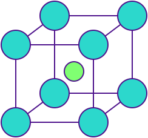
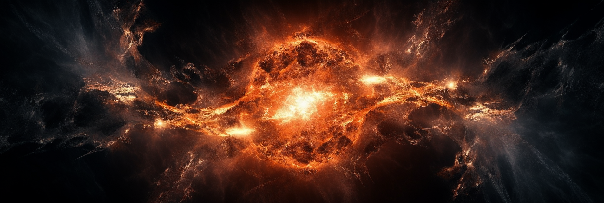

# Fusion energy

<p align="center">
    <!--  -->
    
</p>


[](https://digilabglobal.slack.com)

In this example, we look at the ability of `twinLab` to model the [desorption](https://en.wikipedia.org/wiki/Desorption) (the physical process where a previously adsorbed substance is released from a surface) of tritium (a radioactive isotope of hydrogen) in the wall of a nuclear fusion reactor. Fusion generates almost no radioactive waste, and the little waste that it does produce has a short half-life. However, the interior of the reactor wall is bombarded by a high-neutron flux during fusion, far higher than any naturally-occurring radioactive process, and therefore the properties of materials under high neutron bombardment are unknown. Computer simulations are required to understand the material properties in such extreme circumstances, but simulations are expensive in terms of computational power, and cannot be run at every point in parameter space under consideration. `twinLab` can be used to train simulation surrogate models using data from a sparse array of simulations. This allows for meaningful interpolation and extrapolation to unexplored regions of parameter space, together with a calibrated uncertainty estimate on the accuracy of the simulation surrogate.

## Quick start

Clone the repository and change directory to the project root:
```shell
git clone https://github.com/digiLab-ai/NuclearEnergy.git
cd NuclearEnergy
```

Install the dependencies:
```shell
poetry install
```

Copy the `.env.example` file to `.env` 
```shell
cp .env.example .env
```
and fill out your `twinLab` login details in `.env`

Run the [demo notebook](./demo.ipynb):
```shell
poetry run jupyter notebook demo.ipynb
```
